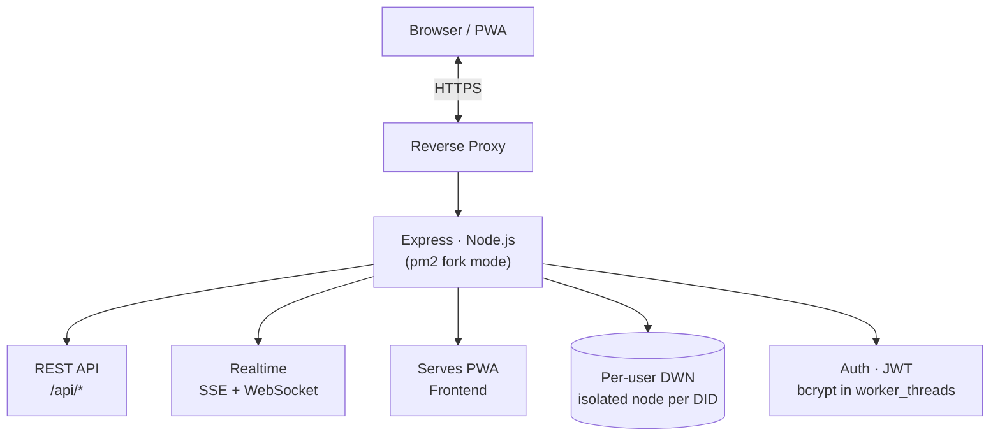

<div align="center">


# MILAN

### Your Space. Your People.

**A privacy-first, decentralized social network where _you_ own your data.**

[](https://www.milanlife.in)
[](https://www.milanlife.in)
[](https://nodejs.org)
[-7c3aed?style=for-the-badge)](https://www.milanlife.in/what-is-web5)

🌐 **[Live App](https://www.milanlife.in)** &nbsp;·&nbsp; 📦 **[Repository](https://github.com/Ignite-boy/milan-app)** &nbsp;·&nbsp; 🧠 **[What is Web5?](https://www.milanlife.in/what-is-web5)**

<br/>


</div>

---

## 📑 Table of Contents

- [Why MILAN](#-why-milan)
- [The MILAN Model](#-the-milan-model)
- [Features](#-features)
- [Tech Stack](#-tech-stack)
- [Architecture](#-architecture)
- [Getting Started](#-getting-started)
- [Configuration](#-configuration)
- [Project Structure](#-project-structure)
- [Deployment](#-deployment)
- [API Overview](#-api-overview)
- [Roadmap](#-roadmap)
- [Author](#-author)
- [License](#-license)

---

## 🌟 Why MILAN

Most social networks are free because **you** are the product — your data lives on corporate
servers, gets tracked, and is sold to advertisers. MILAN flips that model: every user owns a real,
cryptographically-secured data space, and nothing is shared without their consent.

| | Traditional social media | **MILAN** |
|---|:---:|:---:|
| Where your data lives | Corporate servers | **Your own DWN** |
| Who controls it | The platform | **You** |
| Ads & tracking | Yes | **None** |
| Data selling | Yes | **Never** |
| Identity | Owned by platform | **Self-sovereign DID** |
| Default visibility | Public / algorithmic | **Private** |

---

## 🔐 The MILAN Model

> **One User = One DID = One Isolated DWN Space**

Every account is provisioned a unique **Decentralized Identifier (DID)** and a private storage root
at registration. Records and media are written only into that user's own **Decentralized Web Node
(DWN)**. Another user can read a record **only** when the owner makes it public or explicitly grants
access to their DID.

Each post carries one of three access modes:

| Mode | Who can see it |
|------|----------------|
| 🔒 **private** | Only the owner |
| 🌍 **public** | Everyone, via the public feed |
| 🤝 **shared_did** | Only the specific DIDs the owner grants |

---

## ✨ Features

**Identity & Privacy**
- Per-user isolated DWN storage with DID-based accounts
- Private-by-default posts; consent-based, DID-level sharing

**Social**
- Home / public / friends / my-posts feeds
- DID-based friend requests, reactions, comments, notifications, saved posts, profile editing

**Media & Music**
- Image, video, audio, and text posts — streaming uploads, reels-style playback
- **MILAN Music** — free song search & playback (Audius + YouTube) with true **background audio**
  that keeps playing when the app is minimized or the screen is locked

**Experience**
- **Realtime** notification push over Server-Sent Events + WebSockets (no heavy polling)
- **Seamless open** — the home feed paints instantly from a warm cache, then refreshes in the background
- Installable **PWA** with offline shell and a native-like mobile UI
- Engagement system — XP, levels, streaks, badges, and a leaderboard

---

## 🛠️ Tech Stack

| Layer | Technology |
|-------|-----------|
| **Runtime** | Node.js ≥ 18 |
| **Server** | Express · `compression` · single-process (pm2 **fork** mode) |
| **Auth** | JWT (`jsonwebtoken`) + bcrypt (`bcryptjs`, offloaded to `worker_threads`) |
| **Identity & storage** | `@tbd54566975/dwn-sdk-js` · `@web5/dids` · `@web5/crypto` |
| **Realtime** | Server-Sent Events + WebSocket (`ws`) |
| **Media** | `ffmpeg-static` · `ffprobe-static` · `yt-dlp` (audio stream proxy) |
| **Email** | `nodemailer` |
| **Frontend** | Vanilla HTML / CSS / JS Progressive Web App, served by the backend |

---

## 🏗️ Architecture



---

## 🚀 Getting Started

```bash
# 1. Clone
git clone https://github.com/Ignite-boy/milan-app.git
cd milan-app/backend

# 2. Install dependencies
npm install

# 3. Configure environment (see below), then start
npm start
```

The backend serves both the API and the web app on port `5000`. In production, MILAN is served at
**[https://www.milanlife.in](https://www.milanlife.in)** behind a reverse proxy.

### Audio streaming dependency

Background music uses `yt-dlp` at `backend/bin/yt-dlp` (not tracked in git). On a fresh clone,
install it once:

```bash
mkdir -p backend/bin
curl -L https://github.com/yt-dlp/yt-dlp/releases/latest/download/yt-dlp_linux -o backend/bin/yt-dlp
chmod +x backend/bin/yt-dlp
```

---

## ⚙️ Configuration

Copy `backend/.env.example` to `backend/.env` and set your values:

| Variable | Purpose |
|----------|---------|
| `JWT_SECRET` | **Required in production** — long random string that signs sessions |
| `YOUTUBE_API_KEY` | Optional — YouTube Data API for music search (keyless fallbacks work without it) |
| `RESEND_API_KEY`, `MAIL_*` | Email delivery (verification, login alerts) |
| `ADMIN_TOKEN` | Protects admin endpoints |

> ⚠️ `.env`, user data (`backend/dwn/`, `backend/real-dwn-engine/`), and `node_modules/` are
> **git-ignored** and must never be committed.

---

## 📂 Project Structure

```
milan-app/
├── backend/              Express server, APIs, and data stores
│   ├── server.js         App entry — serves the API + frontend/ (port 5000)
│   ├── routes/           auth, social, connections, music, profile, settings, …
│   ├── services/         livePush (SSE/WS), cryptoPool (worker bcrypt), DWN registry
│   ├── dwn/              Per-user isolated DWN spaces + JSON stores   (git-ignored)
│   └── real-dwn-engine/  Per-user real DWN nodes                      (git-ignored)
├── frontend/             PWA — app.html, music.html, service worker, assets
├── docs/                 Design, SEO, and release documentation
├── scripts/              Release / deploy tooling
└── deploy.sh             Server-side deploy script
```

---

## 🌐 Deployment

Production runs under **pm2 in fork mode** (single process):

```bash
cd backend
NODE_ENV=production pm2 start ecosystem.config.js
pm2 save
```

> ⚠️ **Never use pm2 cluster mode.** MILAN's JSON stores and embedded LevelDB lock to a single
> process — multiple workers would corrupt data. To scale horizontally, migrate shared state to
> Redis / Postgres first.

The backend serves the frontend directly, so frontend changes go live immediately (no build step);
versioned assets use `?v=` cache-busters for safe cache invalidation.

---

## 📡 API Overview

All endpoints are grouped under `/api`:

`auth` · `social` · `connections` · `requests` · `profile` · `settings` · `records` ·
`music` · `did` · `crypto` · `protocols` · `isolated-dwn` · `cloud-dwn` · `activity` ·
`security` · `admin` · `ai` · `backup` · `v3` (xp / streak / badges / leaderboard)

**Realtime:** Server-Sent Events at `/api/events` and WebSocket at `/ws?token=…`.

---

## 🗺️ Roadmap

- [x] Per-user isolated DWN + DID identity
- [x] Social feeds, connections, reactions, comments, notifications
- [x] Rich media posts + MILAN Music with background audio
- [x] Realtime push (SSE + WebSocket) and seamless PWA open
- [ ] Native mobile app wrapper with background playback service
- [ ] Encrypted direct messaging
- [ ] Federation between independent MILAN nodes

---

## 👤 Author

<table>
  <tr>
    <td>
      
    </td>
    <td>
      <b>Nitesh Pandey</b><br/>
      Founder &amp; creator of MILAN — full-stack developer building a self-sovereign,
      privacy-first alternative to surveillance-based social media.<br/>
      🌐 <a href="https://www.milanlife.in">milanlife.in</a>
    </td>
  </tr>
</table>

---

## 📄 License

Copyright © 2025–2026 **Nitesh Pandey** — MILAN ([milanlife.in](https://www.milanlife.in)).
See [LICENSE](LICENSE) for details.

---

<div align="center">

**Built with privacy first.** &nbsp;·&nbsp; [milanlife.in](https://www.milanlife.in)

<sub>Your Space. Your People.</sub>

</div>
